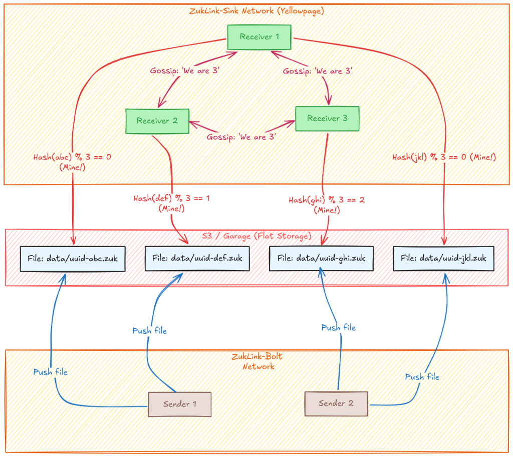
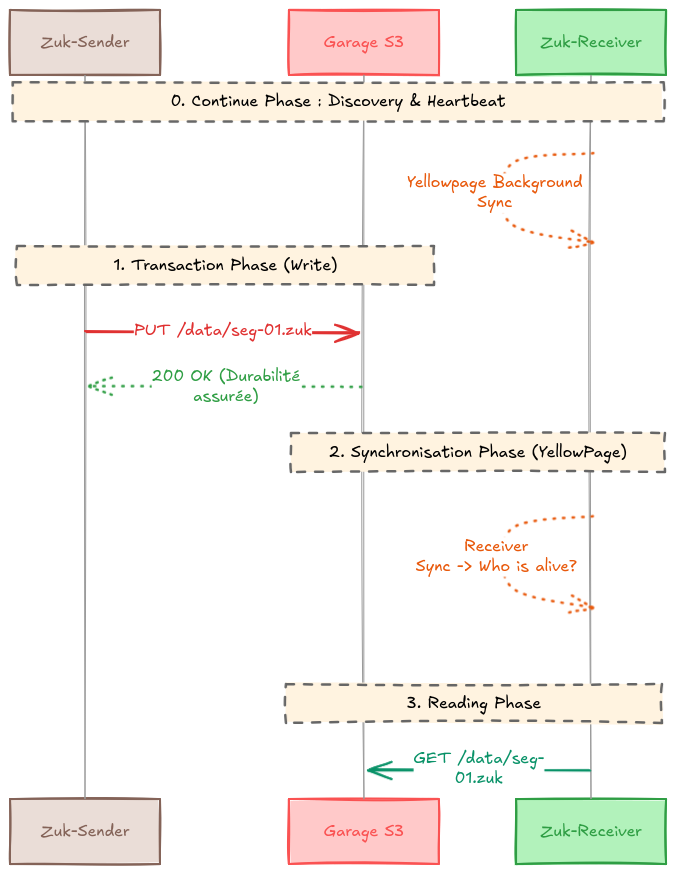

# ZukLink

**ZukLink** est une plateforme de streaming distribuée native pour le Cloud.
Elle implémente une architecture **"Flat Storage / Smart Receiver"** : les producteurs écrivent la donnée le plus vite possible sans se soucier de l'organisation, et les consommateurs s'auto-organisent pour traiter le flux en parallèle.

## 🏗 Architecture

L'architecture repose sur trois composants clés :

1. **Flat Storage (S3)** : Le stockage est la seule source de vérité. Les données sont écrites en vrac (Flat) sous forme de segments immuables.
2. **Yellowpage (Gossip)** : Les Receivers forment un réseau Peer-to-Peer pour maintenir une vue synchronisée du cluster (`ClusterView`).
3. **Dynamic Sharding** : Chaque Receiver utilise la `ClusterView` pour filtrer mathématiquement les fichiers qu'il doit traiter (Consistent Hashing).
4. **Smart Receiver** : Les Receivers sont des services autonomes qui s'auto-organisent pour traiter le flux en parallèle. Ils utilisent la `ClusterView` pour décider quelles données ils doivent traiter.




## 📂 Structure du Workspace

Ce projet est un Workspace Rust standard.

| Crate | Type | Responsabilité |
| --- | --- | --- |
| `libs/zuklink-yellowpage` | Lib | **Cerveau Collectif**. Bibliotèque embarquée utilisant un protocole de Gossip (UDP/TCP) pour la découverte des membres et le Heartbeat. |
| `apps/zuk-bolt` | Bin | **Sender**. Service d'ingestion ("Dumb Writer"). Il reçoit les données et les persiste sur S3 avec un nom unique (UUID). Aucune logique de partitionnement. |
| `apps/zuk-sink` | Bin | **Receiver**. Service de traitement ("Smart Reader"). Il polle S3 et ne télécharge que les fichiers qui lui sont assignés par l'algorithme de hachage. |


## ⚙️ Fonctionnement Technique


### 1. Ingestion (Zuk-Bolt)

Le Sender est conçu pour la haute performance en écriture.

* **Input :** Flux de données (TCP/HTTP).
* **Action :** Génération d'un UUID v4.
* **Output :** Écriture atomique `PUT s3://bucket/data/<uuid>.zuk`.
* **Note :** Le Sender ne connaît pas les Receivers.

### 2. Coordination (Yellowpage)

Les instances de `zuk-sink` s'auto-découvrent via le port de Gossip configuré.

* Elles échangent des messages `Alive`, `Suspect`, `Dead`.
* Elles convergent vers une liste triée identique : `[NodeA, NodeB, NodeC]`.

### 3. Répartition de Charge (Zuk-Sink)

Chaque Receiver exécute une boucle de lecture (Polling) sur le bucket S3 :

```rust
// Logique de Sharding Distribué
fn should_process(filename: &str, my_index: usize, cluster_size: usize) -> bool {
    let hash = calculate_hash(filename);
    // Si le reste de la division correspond à mon index, je traite.
    (hash % cluster_size) == my_index
}

```

## 🚀 Démarrage Rapide

### Prérequis

* **Rust** (Edition 2024)
* **Docker Compose** (Pour l'environnement local)

### Lancer le Cluster

Le fichier `compose.yaml` démarre MinIO, crée le bucket, lance 1 Sender et 2 Receivers.

```bash
# Démarrer l'infrastructure
docker compose up -d

# Voir les logs des Receivers (pour observer la coordination)
docker compose logs -f receiver

```

### Configuration

Les services se configurent via variables d'environnement (12-Factor App).

| Variable | Description | Défaut |
| --- | --- | --- |
| `ZUK_S3_ENDPOINT` | URL du stockage S3 | `http://minio:9000` |
| `ZUK_S3_BUCKET` | Nom du bucket | `zuk-data` |
| `ZUK_GOSSIP_PORT` | Port d'écoute Yellowpage | `7000` |
| `ZUK_SEEDS` | Nœuds initiaux pour le Gossip | `receiver-1:7000` |

## 🛠 Développement

### Règles Architecturelles

* **Stateless Storage :** S3 est la seule source de persistance. Si tout le cluster redémarre, l'état est reconstruit depuis S3.
* **Shared Nothing :** Les Receivers ne partagent aucune base de données.
* **At Least Once :** En cas de changement de topologie (nouveau membre), un fichier peut être traité deux fois temporairement. Les consommateurs finaux doivent être idempotents.

### Commandes Utiles

```bash
# Tests
cargo test

# Linting
cargo clippy -- -D warnings

```

## 📄 Licence

Apache-2.0
